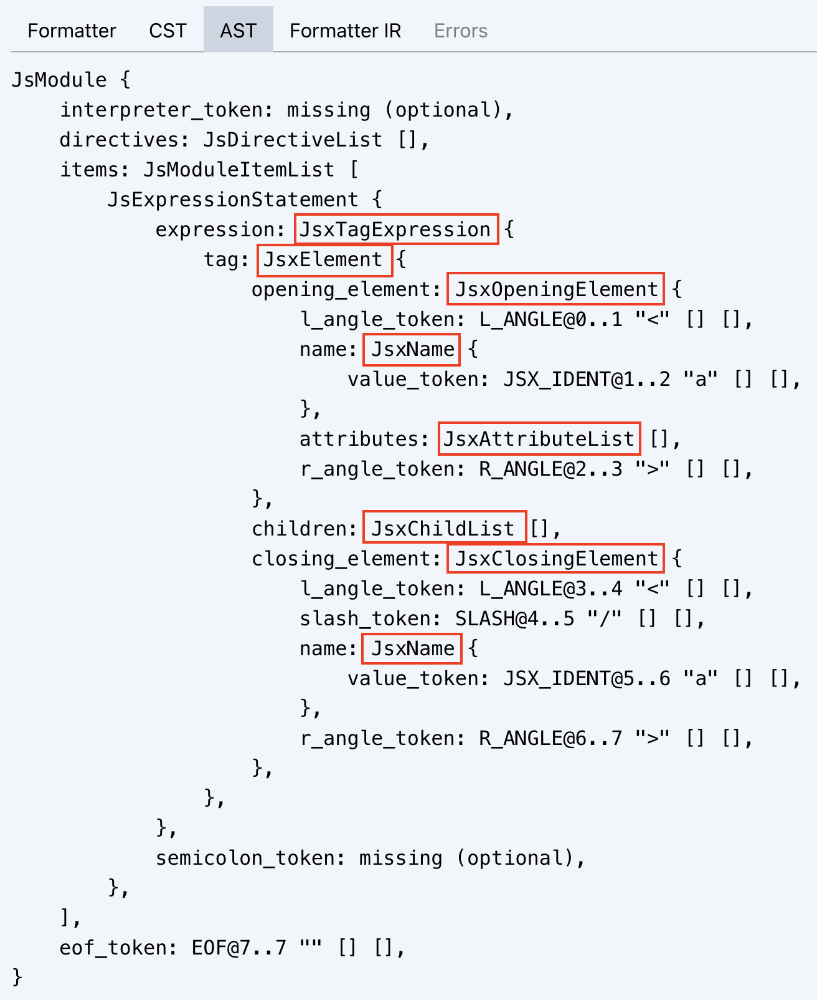
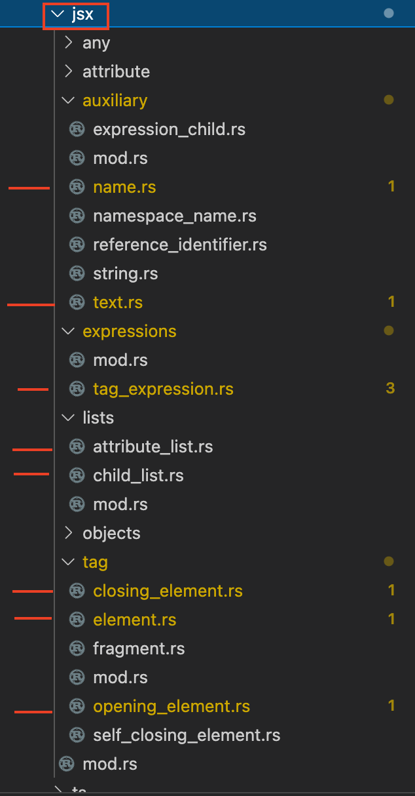
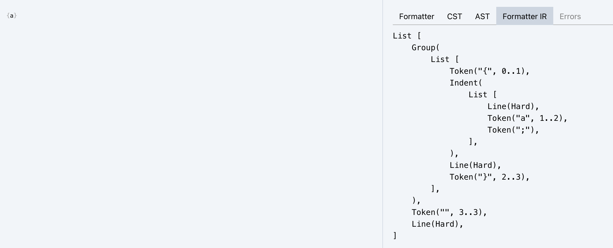

Issue: https://github.com/rome/tools/issues/2275

### Mob Session 1 Learnings:
1. How to use the Rome playground to see the AST that was being constructed, given syntax.
2. Given syntax input, how to use .format to tell `rome_formatter` to navigate ("visit") a node, and that there is essentially a 1:1 mapping between a file (`impl ToFormatElement for`) per Abstract Syntax Tree Node for the given syntax input
3. Where to add test files,  and how to generate snapshot tests. ( https://github.com/RustPhilly/tools/blob/main/crates/rome_formatter/docs/write_tests.md )

Example AST (from Rome Playground):



Example of which files might map to nodes in the above example tree, each file has a `impl ToFormatElement`:




### Mob Session 2 Learnings:
1. Understanding that our goal, when adding logic to `rome_formatter`, is to create an Intermediate representation of FormatElements, where `FormatElement` are just a handful of enums. That this (Formatter IR) is an additional abstraction on top of the AST/CST that the parser generates. (also shown on the Rome playground).
2. How to build and open docs for rome_formatter's formatter.
3. That the formatter helper methods are just helpers that construct pieces of this Formatter IR, ( https://github.com/RustPhilly/tools/blob/main/crates/rome_formatter/docs/implement_the_formatter.md )


4. Formatter helper methods may construct pieces of this IR that we don't want/need - for example, `formatter.format_list` injecting `LineMode::Empty` or `LineMode::Hard`, leaving us w/ questions like:

Outstanding Questions:
1. When do we want to use an existing `formatter` helper?
2. When do we want to leave `formatter` untouched and keep our logic within a specific Node type's `ToFormatElement` ?
3. When do we want to add a `formatter` helper?
4. When do we want to modify an existing `formatter` helper implementation?

In deriving answers for these questions, we've uncovered that there are three distinct areas of the codebase that we'll care about while contributing to the rome formatter

1. `formatter` (`Formatter` instance) - tends to be language agnostic (it should not know anything about the AST) and it's the one in charge of manipulating tokens and trivias. It's like a CRUD for our internal IR.
2. `utils` - function groups common patterns around a specific language (as for now, only JS and its super languages). These `utils` usually work directly on the AST too.
3. `format_element` - functions that you need to **create** the `rome_formatter` IR. Our IR is essentially an `enum`, called `FormatElement`. **Using utility functions are way better** because they better help to shape and create the IR. For example, it's better to use a function called `soft_line_break_or_space` instead of directly using its implementation. 

This means, when we aren't using or modifying formatter helpers (`formatter` methods) to manipulate `tokens` and `trivia`, then we need to determine whether we should be using or modifying `utils` or writing custom logic in `ToFormatElement`.

# Rome formatter FAQ

When should I

### use an existing `formatter` method?
- Try to find existing helpers but it's OK to use the low-level helpers like `join_elements` / `concat_elements` where necessary.
- Be sure to test your formatting with comments because that's what many of those helpers handle for you.

### leave a `formatter` method untouched and keep our logic within a specific Node type's `ToFormatElement`?
- Anything that is node specific should remain in the node's `ToFormatElement` implementation.
- Theoretically you always use the `formatter`, even when you indirectly call `token.format_or_empty(formatter)`.
- Usually you directly use the `formatter` when you don't have to format recurring patterns such as separated lists, delimited blocks, etc.;

### add a new `formatter` method
- When it's a frequent pattern used by a variety of nodes. If it only applies to a specific group of nodes, prefer `utils` (for example, formatting expressions with left and right hand sides)

### modify an exsting `formatter` method
- when there's a bug or a new requirement in an existing pattern that pops up

# Tokens, Trivia, and Comments FAQ
- What is trivia? See: https://github.com/rome/tools/blob/e2799fdd9ff12f8846dc0076bdf293215229d560/crates/rome_rowan/src/syntax/trivia.rs#L7
- Note that the word `Comment` can mean `FormatElement`, it is a node on the Formatter IR, see: https://github.com/rome/tools/blob/main/crates/rome_formatter/src/format_element.rs#L916

Note: When rome maintainers use the word "comment" they are refer'ing to any of `TriviaPieceKind`: https://github.com/rome/tools/blob/e2799fdd9ff12f8846dc0076bdf293215229d560/crates/rome_rowan/src/syntax/trivia.rs#L7


If we look in the Rome Playground, we can see the Formatter IR is already being constructed, it's just being constructed "poorly" with verbatim tokens:
```rust
// input
<Foo>
    text
    </Foo>

// output
List [
    Verbatim(
        Token("<Foo>\n    text\n    </Foo>", 0..25),
    ),
    Token(";"),
    Token("", 25..25),
    Line(Hard),
]
```

Before we touch any more code, let's write what we think the Formatter IR should actually look like, using approprate `FormatElement` enums: https://github.com/rome/tools/blob/main/crates/rome_formatter/src/format_element.rs#L874

```rust
// input
<Foo>
    text
    </Foo>

// expected output

/* TODO */
```

Naive test case:
```rust
// input
<Foo>
    text
    </Foo>

// Formatter IR output
List [
    Token("<Foo>text</Foo>", 0..15), // <--- We won't be generating an IR like this
    Token(";"),
    Token("", 25..25),
    Line(Hard),
]

// IR as code
<Foo>text</Foo>; // <--- We already know we want this result (to match Prettier output for the same input), but in order to achieve this we have to reason a little more about the Formatter IR being generated above.
```

We won't be generating an IR like above, because each word and symbol should be a Token in the IR. (Think about it: that string of text "\<Foo\>text\<\/Foo\>" would be parsed as a tree of nodes, and each node will have the knowledge of how to format itself as a tree of `FormatterElement`s, which is why we have a file and `impl ToFormatElement` for each node type.

The tricky part, I think will be knowing which formatter functions are available so that we end up with the `Line`'s and `Group`'s and other `FormatElement`s, that we want. (For example, "what is the difference between a `Group` and a `HardGroup`, and will we need it for this test case or the next one...etc..?")
One way to see where `Group`'s and `Line`s and other `FormatElement`s are being inserted is to take a look in the playground for javascript input that has already been implemented:



However once we think we know what the Formatter IR looks like, we'll then want to look through formatter methods and formatter `utils` to see which methods will actually result in the right `Group`s, `Line`s, and other **non-token** `FormatterElement`s, etc.

Our issue: https://github.com/rome/tools/issues/2275
(Other JSX Formatter PR for reference: https://github.com/rome/tools/pull/2273)
